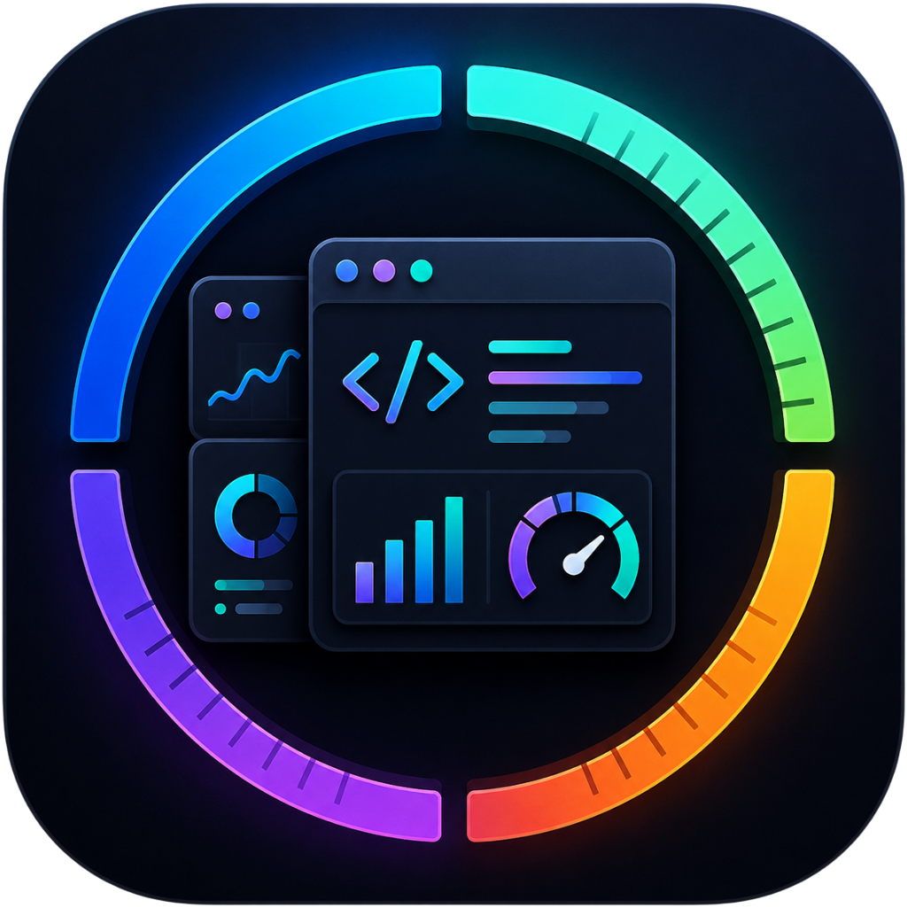
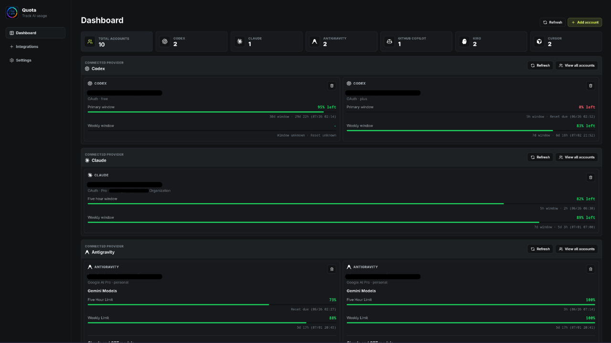
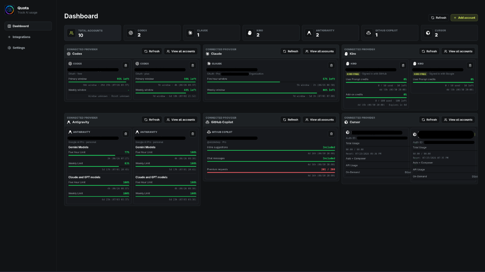
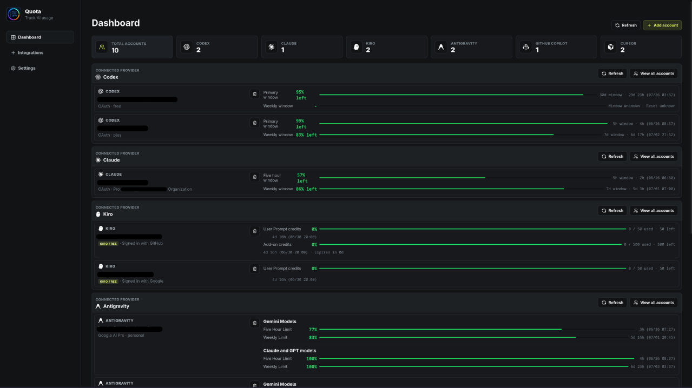
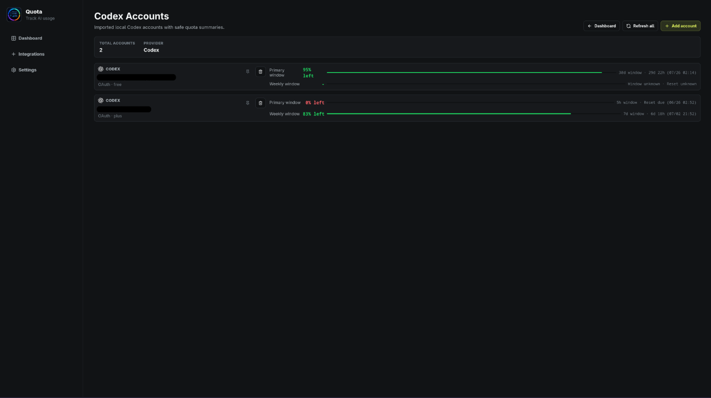
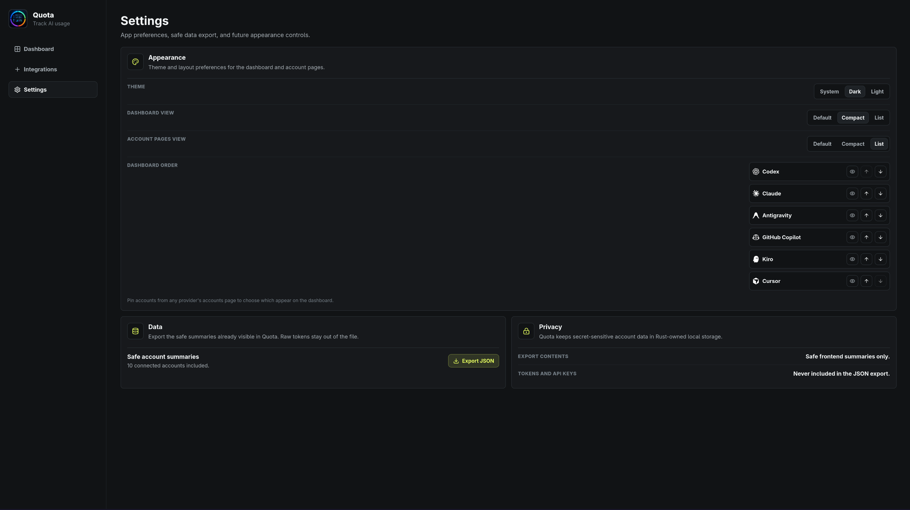

<p align="center">
  
</p>

# Quota

Monitor your AI & dev tool usage in one place.

Quota is a desktop app for monitoring AI usage across accounts. Connect your accounts for each provider, refresh usage and pin accounts to the dashboard for easy tracking.

## Supported Providers

Currently Quota supports the following providers:

- GitHub Copilot
- Codex
- Antigravity
- Claude Code
- Kiro
- Cursor

Every provider saves its raw auth info in the Rust backend and only secure account & usage information are sent to the React frontend.

## Screenshots

### Dashboard



### Compact Dashboard



### List Dashboard



### Accounts Page Example



### Settings



## Features

- Dashboard for connected accounts
- Ordering of providers in Settings
- Account pinning in Dashboard
- Toggle provider visibility without disconnection of accounts
- Dashboard Layouts: Default, Compact, List
- Theme Modes: System, Dark, Light
- Safe JSON Export for account summaries
- Account Pages for providers with refresh and delete buttons
- Tauri desktop shell
- Separate VS Code/OpenVSX extension scaffold in `quota-vscode/`

## Installation

Download for your platform at https://github.com/pinkpixel-dev/quota/releases

Or install from source:

```bash
git clone https://github.com/pinkpixel-dev/quota.git
cd quota
npm install
npm run tauri dev
```

## VS Code Extension

The Quota VSIX is located in `quota-vscode/`. It is a separate TypeScript extension package with a small status bar button, optional configured quota percentages, and a compact webview panel for enabled providers. See the VSIX [README.md](https://github.com/pinkpixel-dev/quota/blob/main/quota-vscode/README.md) for details.

### Extension Installation Options

1. Install from within VSCode, Antigravity or Kiro through the marketplace

2. Download and install from VSIX

- [Open VSX Registry](https://open-vsx.org/extension/pinkpixel/quota-ai-usage-tracker/)

- [Github](https://github.com/pinkpixel-dev/quota/blob/main/quota-vscode/quota-vscode-1.0.0.vsix)

Once the .vsix file is downloaded, open your ide (VSCode, Antigravity, Kiro), press F1, and type in "Extensions: Install from VSIX".

## Contributing

See [CONTRIBUTING.md](./CONTRIBUTING.md) for details.

## License

Quota is licensed under Apache-2.0.

Made with 💖 by Pink Pixel.
