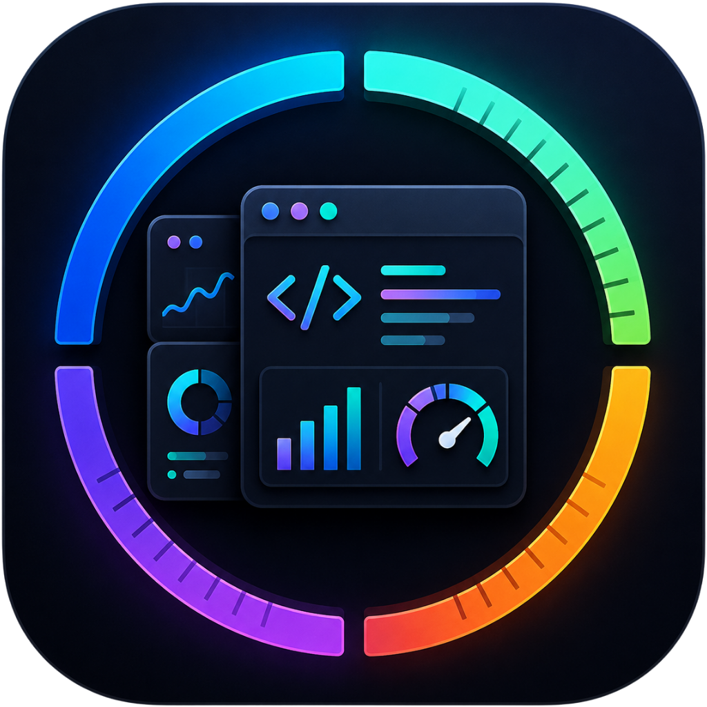
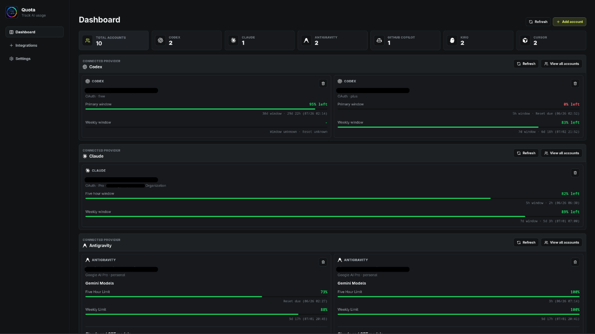
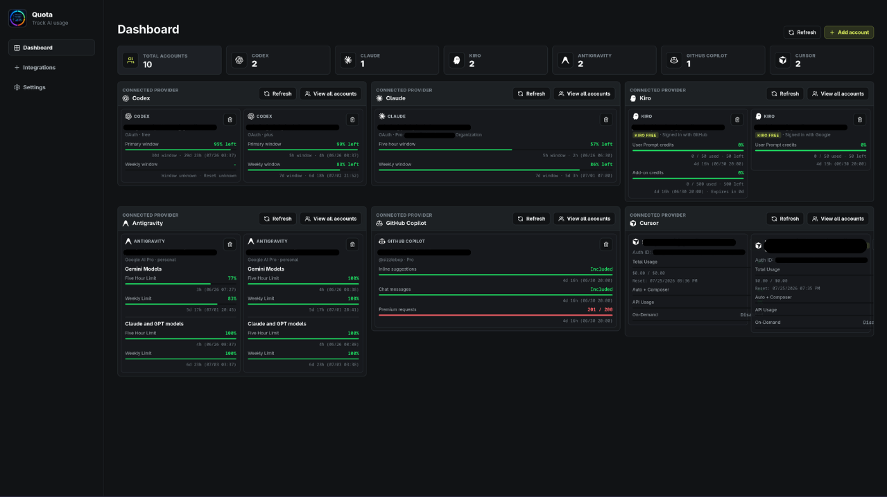
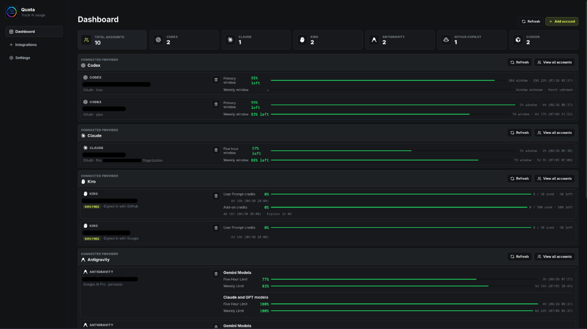
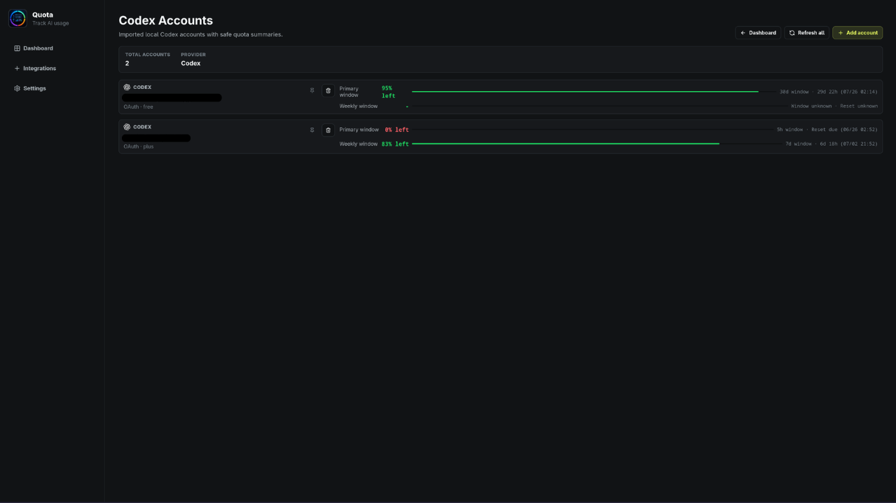
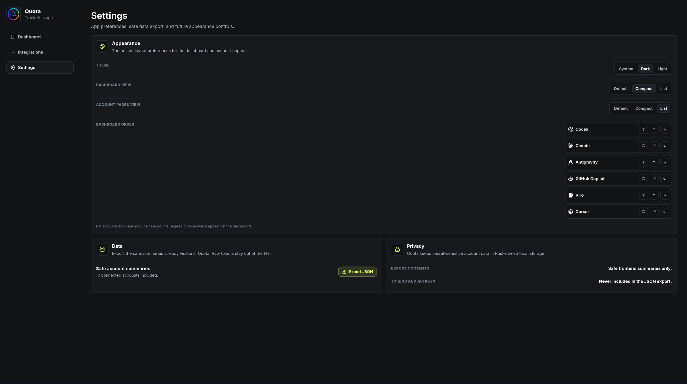

<p align="center">
  
</p>

# Quota

Monitor your AI & dev tool usage in one place.

Quota is a desktop app for monitoring AI usage across accounts. Connect your accounts for each provider, refresh usage and pin accounts to the dashboard for easy tracking.

## Supported Providers

Currently Quota supports the following providers:

- GitHub Copilot
- Codex
- Antigravity
- Claude Code
- Kiro
- Cursor

Every provider saves its raw auth info in the Rust backend and only secure account & usage information are sent to the React frontend.

## Screenshots

### Dashboard



### Compact Dashboard



### List Dashboard



### Accounts Page Example



### Settings



## Features

- Dashboard for connected accounts
- Ordering of providers in Settings
- Account pinning in Dashboard
- Toggle provider visibility without disconnection of accounts
- Dashboard Layouts: Default, Compact, List
- List-mode account actions stay anchored to the far-right edge for easier removal
- Theme Modes: System, Dark, Light
- Safe JSON Export for account summaries
- Opt-in auto refresh with a configurable interval
- System tray — close the window to keep running in the background, click the tray icon to restore
- Opt-in desktop notifications when a quota drops below a configurable threshold
- Account Pages for providers with refresh and delete buttons
- Clear Codex and Claude Code reauthentication prompts when saved authorization expires
- Antigravity AI credit display when credits are available
- Tauri desktop shell
- Separate VS Code/OpenVSX extension scaffold in `quota-vscode/`

## Installation

Download the latest desktop release, [Quota v1.1.1](https://github.com/pinkpixel-dev/quota/releases/tag/v1.1.1), for your platform.

Or install from source:

```bash
git clone https://github.com/pinkpixel-dev/quota.git
cd quota
npm install
npm run tauri dev
```

## VS Code Extension

The Quota VSIX is located in `quota-vscode/`. It is a separate TypeScript extension package with a small status bar button, optional configured quota percentages, and a compact webview panel for enabled providers. See the VSIX [README.md](https://github.com/pinkpixel-dev/quota/blob/main/quota-vscode/README.md) for details.

### Extension Installation Options

1. Install from within VSCode, Antigravity or Kiro through the marketplace

2. Download and install from VSIX

- [Open VSX Registry](https://open-vsx.org/extension/pinkpixel/quota-ai-usage-tracker/)

- [GitHub](https://github.com/pinkpixel-dev/quota/blob/main/quota-vscode/quota-ai-usage-tracker-1.0.5.vsix)

Once the .vsix file is downloaded, open your ide (VSCode, Antigravity, Kiro), press F1, and type in "Extensions: Install from VSIX".

If Codex or Claude Code authorization expires, Quota keeps the account and its last safe quota data visible. Use the Reauthenticate action in the desktop account card or extension panel to renew access without disconnecting the account first.

## Contributing

See [CONTRIBUTING.md](./CONTRIBUTING.md) for details.

## License

Quota is licensed under Apache-2.0.

Made with 💖 by Pink Pixel.
