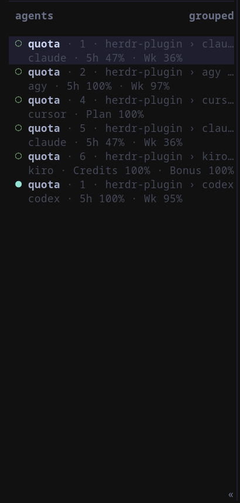

# Quota for Herdr

A Herdr plugin that shows your AI usage right in the sidebar, next to the panes and workspaces where you're actually using it.

## What it shows

The plugin reports a compact usage token onto every pane running an agent it has a provider for, and onto the workspace that pane belongs to. Herdr's sidebar can render that token wherever you add `$quota` to a row.

Each pane gets the numbers for the agent it's actually running, so a Claude pane and a Codex pane show their own figures side by side:



The labels differ by provider, because the providers themselves measure different things:

| Agent kind | Shows | Meaning |
|---|---|---|
| `claude`, `claude-code`, `anthropic` | `5h`, `Wk` | rolling 5 hour and weekly windows |
| `codex` | window lengths from the API | usually `5h` and `Wk` |
| `cursor` | `Plan` | the current billing cycle |
| `agy`, `antigravity`, `antigravity-cli` | `5h`, `Wk` | the Gemini model windows |
| `grok` | `Credit` | the credit pool for the billing period |
| `kiro` | `Credits`, `Bonus` | base credits, and a bonus or free trial pool when you have one |

The percentages are how much you have left, not how much you've used.

If no pane in your session is running a supported agent, the plugin does nothing and makes no network call. Only the providers that actually have a pane on screen get fetched, so a Codex pane never costs you a Cursor request.

A workspace row only gets a token when every reportable pane in that workspace runs the same agent. The workspace row has no agent name on it, so in a mixed workspace any single number would look like it applied to all of them. The per-pane rows still show everything.

## Installing quota-cli

The plugin runs a small binary called `quota-cli` to read your usage and hand it to Herdr. It's published on crates.io:

```bash
cargo install quota-cli
```

### CLI usage

```bash
quota-cli usage
```

```text
claude   5h 98% (resets in 4h 58m) · Wk 35% (resets in 3d 9h)
codex    5h 100% (resets in 4h 59m) · Wk 95% (resets in 4d 6h)
cursor   Plan 100% (resets in 8d 3h)
```

### **You must install `quota-cli` first for the plugin to work.**

## Installing the plugin

With `quota-cli`installed, link this plugin into Herdr:

```bash
herdr plugin install pinkpixel-dev/quota/herdr-plugin
```

## Adding the sidebar rows

The plugin doesn't touch your Herdr configuration. Adding `$quota` to a sidebar row is entirely your call, and you do it by hand in `~/.config/herdr/config.toml`.

For the agents sidebar:

```toml
[ui.sidebar.agents]
rows = [["state_icon", "machine", "workspace", "tab"], ["agent", "$quota"]]
```

For the spaces sidebar:

```toml
[ui.sidebar.spaces]
rows = [["state_icon", "machine", "workspace", "tab"], ["agent", "$quota"]]
```

Feel free to place `$quota` wherever it fits your layout better. After editing the config, reload it with `herdr server reload-config`.

## Optional: a keybinding to refresh on demand

There's no timer running in the background, because Herdr has no periodic event. Usage gets reported when Herdr starts, when an agent is detected in a pane, when a pane's agent status changes, when you focus a pane, and when you run the `refresh` action.

Each time `quota-cli herdr report` runs, it serves a cached value unless that value is older than 120 seconds, in which case it fetches a fresh one. That means the number you see can lag a real change by up to about two minutes. If you want it immediately, add a keybinding for the `refresh` action, which always bypasses the cache:

```toml
[[keys.command]]
key = "prefix+u"
type = "plugin_action"
command = "pinkpixel.quota.refresh"
description = "refresh Quota usage"
```

Pick whatever key combination makes sense for your setup. `prefix+u` is just an example.

Once a token is reported it stays on the pane until something replaces it. It won't quietly disappear while you're idle.

## Optional: keeping the numbers moving on their own

A keybinding still needs you to press it. If you'd rather the sidebar just stayed current, `quota-cli` can do the refreshing itself:

```bash
quota-cli herdr watch
```

That reports, waits, and reports again until you stop it. The interval defaults to 300 seconds, and `--interval SECONDS` changes it. Anything under 120 seconds is refused, because a cycle inside the cache window serves the number it already has and fetches nothing.

The plugin doesn't start this for you. Herdr's plugin hooks are meant for bounded, one-shot work rather than long-running processes, and a watcher started from a hook would need to survive restarts and avoid running twice over. Keeping it a command you run means you decide whether it runs at all, and you can see it when it misbehaves.

Run it in a pane, or wire it into whatever already starts things on your machine. A systemd user service is the usual choice on Linux:

```ini
[Unit]
Description=Quota usage in the Herdr sidebar

[Service]
ExecStart=%h/.cargo/bin/quota-cli herdr watch --interval 300
Restart=on-failure

[Install]
WantedBy=default.target
```

Save that as `~/.config/systemd/user/quota-herdr.service`, then:

```bash
systemctl --user enable --now quota-herdr.service
```

One thing to know: started this way, the watcher runs outside Herdr, so it doesn't get the plugin's environment. It falls back to a cache in your temp directory instead of the plugin's state directory, which works fine but means it and the plugin keep separate caches. Both report the same numbers to the same panes.

If Herdr isn't running yet, the watcher says so and keeps going, so it's safe to start either one first.

## Reading your credentials

This plugin reads each agent CLI's locally stored credentials to work out your usage. Those reads are strictly read-only. Nothing here refreshes, rewrites, or rotates a credential file, because doing that would risk invalidating the session your own CLI depends on.

Antigravity is the one exception, and a narrow one. Google doesn't rotate its refresh token, so a fresh access token is held in memory for a single request and nothing is ever written to disk.

One thing worth knowing: several of these tools keep separate credentials for their CLI and their IDE, and the two can be different accounts. Cursor, Kiro, and Antigravity all do this. The plugin always reads the CLI's store, since that's the thing actually running in your pane.

## When the sidebar shows nothing

A blank `$quota` token usually means one of a few things:

- No pane in the current session is running a supported agent. The plugin only reports for the agent kinds listed above, so this is expected.
- You're not signed into that provider's CLI, or its token has expired.
- `quota-cli` isn't on `PATH`, or the plugin can't find it.
- The last fetch failed and there's no cached value yet to fall back to.

Start with the CLI, since it prints the actual reason per provider:

```bash
quota-cli usage
```

If that looks right but the sidebar doesn't, check what the plugin did:

```bash
herdr plugin log list --plugin pinkpixel.quota
```

That shows the plugin's recent invocations, including exit codes and any error output, which is usually enough to tell you what went wrong.

## Alternative Installation

Prebuilt binaries for Linux, macOS, and Windows are attached to the `quota-cli-v*` [releases](https://github.com/pinkpixel-dev/quota/releases). Unpack the archive for your platform and put `quota-cli` somewhere on your `PATH`:

```bash
mkdir -p ~/.local/bin
cp quota-cli ~/.local/bin/quota-cli
```

Make sure the directory is actually on your shell's `PATH`. The plugin manifest invokes `quota-cli` by name, so Herdr needs to be able to find it the same way your shell would.

If you're working from a local checkout, point it at the plugin directory:

```bash
herdr plugin link /path/to/quota/herdr-plugin
```

