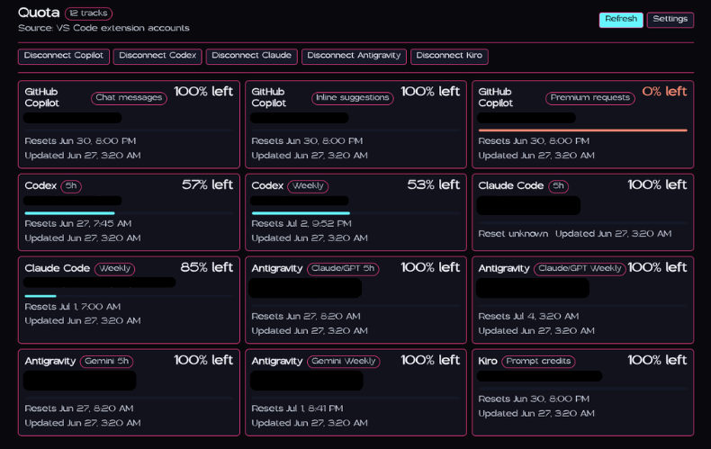
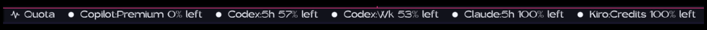

# Quota: AI Usage Tracker

Track AI usage from the editor you already have open. Quota adds a compact status bar button and a resize-friendly quota panel for GitHub Copilot, Codex, Claude Code, Antigravity, and Kiro.

## See your AI quota at a glance

Quota is built for developers who use more than one AI coding tool and want one place to check usage before a limit surprises them. Connect the providers you use, pin the tracks you care about, and open the panel whenever you want the full picture.



## What Quota does

- **Tracks multiple providers**: GitHub Copilot, Codex, Claude Code, Antigravity, and Kiro
- **Shows a permanent status bar button**: open Quota without leaving your editor
- **Pins quota tracks to the status bar**: choose the exact limits you want visible while coding
- **Opens a compact quota panel**: scan percent used or remaining, reset timing, and last update time
- **Refreshes extension-owned accounts**: use manual refresh or the built-in refresh interval
- **Keeps provider tokens in SecretStorage**: raw credentials stay in VS Code's secret store
- **Works with VS Code-style editors**: designed for VS Code and OpenVSX-compatible IDEs

## Supported providers

Quota currently supports direct extension-owned auth for:

| Provider | Tracks |
| --- | --- |
| GitHub Copilot | Premium requests, chat messages, inline suggestions |
| Codex | 5h usage, weekly usage |
| Claude Code | 5h usage, weekly usage, weekly Sonnet, extra usage |
| Antigravity | Gemini 5h, Gemini weekly, Claude/GPT 5h, Claude/GPT weekly |
| Kiro | Prompt credits |

Cursor is not included in the extension because modern Cursor is its own standalone app. The Quota desktop app can still track Cursor.

## Status bar

Keep Quota visible without crowding your editor. The main `Quota` button opens the panel, and optional pinned tracks can show specific quotas beside it.



Example pinned tracks:

- `codex.primary`
- `claude.fiveHour`
- `githubCopilot.premium`
- `antigravity.gemini`
- `kiro.promptCredits`

## Quota panel

Click the status bar button or run `Quota: Open Quota Panel` to open the in-editor panel. The panel uses a single column in narrow layouts and multiple columns in wider layouts, so it stays readable whether you keep it slim or stretch it across the editor.

Each track shows:

- Provider and quota name
- Connected account label
- Percent used or percent remaining
- Reset time when available
- Last updated time
- Provider connect, disconnect, refresh, and settings actions

## Connect accounts

Run the matching connect command from the Command Palette:

- `Quota: Connect GitHub Copilot`
- `Quota: Connect Codex`
- `Quota: Connect Claude Code`
- `Quota: Connect Antigravity`
- `Quota: Connect Kiro`

Each provider uses its own auth flow. Quota stores raw provider tokens only in VS Code SecretStorage and stores display-safe account metadata in extension state.

## Configure Quota

Open `Quota: Open Settings` or edit your VS Code settings:

```json
{
  "quota.dataSource": "extensionAccounts",
  "quota.refresh.intervalSeconds": 120,
  "quota.providers.enabled": [
    "githubCopilot",
    "codex",
    "claude",
    "antigravity",
    "kiro"
  ],
  "quota.statusBar.enabled": true,
  "quota.statusBar.items": ["codex.primary"],
  "quota.statusBar.display": "percentUsed",
  "quota.statusBar.maxItems": 3
}
```

## Available commands

| Command | Description |
| --- | --- |
| `Quota: Open Quota Panel` | Open the compact quota panel |
| `Quota: Refresh Summary` | Refresh connected provider data |
| `Quota: Open Settings` | Open Quota settings |
| `Quota: Connect GitHub Copilot` | Connect a GitHub Copilot account |
| `Quota: Refresh GitHub Copilot` | Refresh GitHub Copilot quota data |
| `Quota: Disconnect GitHub Copilot` | Remove extension-stored GitHub Copilot credentials |
| `Quota: Connect Codex` | Connect a Codex account |
| `Quota: Refresh Codex` | Refresh Codex quota data |
| `Quota: Disconnect Codex` | Remove extension-stored Codex credentials |
| `Quota: Connect Claude Code` | Connect a Claude Code account |
| `Quota: Refresh Claude Code` | Refresh Claude Code quota data |
| `Quota: Disconnect Claude Code` | Remove extension-stored Claude Code credentials |
| `Quota: Connect Antigravity` | Connect an Antigravity account |
| `Quota: Refresh Antigravity` | Refresh Antigravity quota data |
| `Quota: Disconnect Antigravity` | Remove extension-stored Antigravity credentials |
| `Quota: Connect Kiro` | Connect a Kiro account |
| `Quota: Refresh Kiro` | Refresh Kiro quota data |
| `Quota: Disconnect Kiro` | Remove extension-stored Kiro credentials |

## Status bar track IDs

Use these IDs in `quota.statusBar.items`:

```json
[
  "githubCopilot.premium",
  "githubCopilot.chat",
  "githubCopilot.inline",
  "codex.primary",
  "codex.weekly",
  "claude.fiveHour",
  "claude.weekly",
  "claude.weeklySonnet",
  "claude.extraUsage",
  "antigravity.gemini",
  "antigravity.geminiWeekly",
  "antigravity.claude",
  "antigravity.claudeWeekly",
  "kiro.promptCredits"
]
```

## Privacy and storage

Quota is local-first. Direct auth makes the extension a token-holding app, so it keeps the storage boundary tight:

- Raw provider tokens stay in VS Code SecretStorage
- Display-safe account metadata and quota cache live in extension global state
- Disconnect commands delete extension-owned credentials and cached quota data
- The extension does not use remote sponsor, ad, announcement, or relay services

## Desktop app

Quota also has a desktop app for a broader account dashboard and provider management. Download it from the [Quota GitHub releases page](https://github.com/pinkpixel-dev/quota/releases).

## Publisher

Made by [Pink Pixel](https://pinkpixel.dev).
