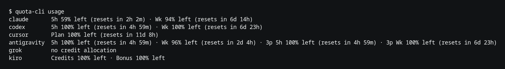

import { Tabs, TabItem } from '@astrojs/starlight/components';
import { cli } from '../../../data/site';

`quota-cli` prints how much quota you have left across Claude, Codex, Cursor, Antigravity, Grok and Kiro. It reads each provider's token from wherever that provider's own CLI keeps it, so there's no sign-in step, no config file and no account to connect. If you're logged into Claude Code, you get Claude numbers. If you're not, it says so and moves on.

It doesn't need the desktop app installed or running.



## Install

<Tabs>
  <TabItem label="Cargo">
    ```bash
    cargo install quota-cli
    ```
    Kiro's credentials live in a SQLite database that's compiled from bundled C source, so the build needs a working C compiler. This is also how you install it on a Mac.
  </TabItem>
  <TabItem label="Prebuilt binary">
    Download the archive for your platform from the <a href={cli.releaseUrl}>quota-cli {cli.version} release</a>:

    - Linux: <a href={cli.linux}><code>quota-cli-x86_64-unknown-linux-gnu.tar.gz</code></a>
    - Windows: <a href={cli.windows}><code>quota-cli-x86_64-pc-windows-msvc.zip</code></a>

    Unpack it and put `quota-cli` somewhere on your `PATH`. On Linux, for example:

    ```bash
    mkdir -p ~/.local/bin
    cp quota-cli ~/.local/bin/quota-cli
    ```
  </TabItem>
</Tabs>

## Usage

```bash
quota-cli usage
```

Percentages are what you have left, not what you've used. Reset times show up when a provider reports one, and Kiro currently doesn't.

For scripts, `--json` prints the same data as an array:

```bash
quota-cli usage --json
```

Providers you're not signed into go to stderr instead of the JSON. The command only exits non-zero when no provider at all could report, since one signed-out provider isn't really a failure.

## Commands

| Command | What it does |
| --- | --- |
| `quota-cli usage [--json]` | Prints your current usage |
| `quota-cli herdr report [--force]` | Pushes usage into the Herdr sidebar. The [Herdr plugin](/docs/herdr/) runs this for you |
| `quota-cli herdr watch [--interval SECONDS]` | Reports to Herdr on a loop. Defaults to 300 seconds, minimum 120 |
| `quota-cli --help` | Shows help |

## Where the credentials come from

| Provider | Source |
| --- | --- |
| Claude | `~/.claude/.credentials.json` |
| Codex | `~/.codex/auth.json`, honoring `CODEX_HOME` |
| Cursor | `~/.config/cursor/auth.json` |
| Antigravity | OS keyring, falling back to `~/.gemini/oauth_creds.json` |
| Grok | `~/.grok/auth.json`, honoring `GROK_HOME` |
| Kiro | `~/.local/share/kiro-cli/data.sqlite3`, falling back to the AWS SSO cache |

Cursor, Kiro and Antigravity keep separate credentials for their CLI and their IDE, and the two can be different accounts. `quota-cli` reads the CLI's store first, because that's the session an agent in your terminal actually uses.

GitHub Copilot and OpenCode Go aren't supported in the CLI yet. The desktop app and the VS Code extension cover both.

## It's read-only

Nothing gets refreshed, rewritten or rotated, because those tokens back your own agent sessions. Rotating one could leave your real CLI holding a dead credential. Antigravity is the one exception: Google doesn't rotate its refresh token, so a fresh access token is held in memory for one request and nothing is written to disk.

That shows up most with Kiro. Its CLI only refreshes its token when it has a reason to call the service, so an idle machine can hold a lapsed token. When that happens `quota-cli` tells you instead of showing a number, and using Kiro again fixes it.

Tokens are never logged or printed.
