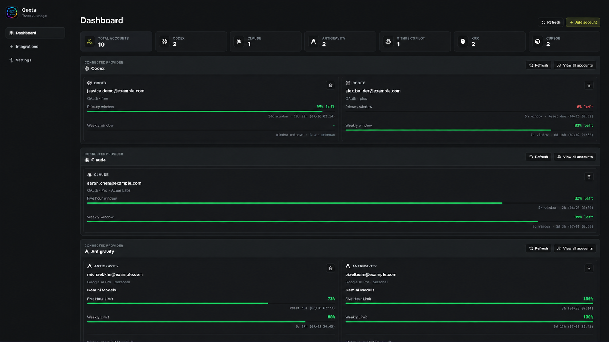
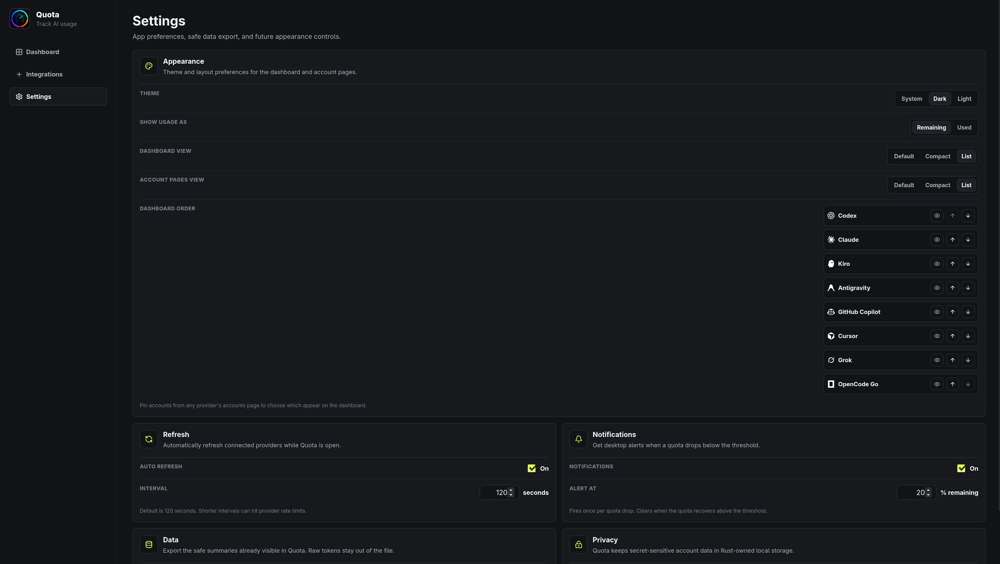

import { Steps, Tabs, TabItem } from '@astrojs/starlight/components';
import DownloadTable from '../../../components/DownloadTable.astro';
import dashboard from '../../../assets/screenshots/default_dashboard.png';
import compact from '../../../assets/screenshots/compact_dashboard.png';
import list from '../../../assets/screenshots/list_dashboard.png';
import { Image } from 'astro:assets';

The desktop app is the full version of Quota. It's a Tauri app with a dashboard for every connected account, a system tray menu, optional auto refresh, and low-quota notifications. It runs on Windows and Linux.



## Install

<DownloadTable />

<Tabs syncKey="os">
  <TabItem label="Windows">
    Download the `.exe` installer (or the `.msi` if you prefer) and run it. To update, install the new version over the old one.
  </TabItem>
  <TabItem label="AppImage">
    ```bash
    chmod +x Quota_*_amd64.AppImage
    ./Quota_*_amd64.AppImage
    ```
  </TabItem>
  <TabItem label="Debian / Ubuntu">
    ```bash
    sudo apt install ./Quota_*_amd64.deb
    ```
  </TabItem>
  <TabItem label="Fedora / openSUSE">
    ```bash
    sudo dnf install ./Quota-*.x86_64.rpm
    ```
    On openSUSE, use `sudo zypper install` with the same file.
  </TabItem>
</Tabs>

There's no macOS build right now. If you're on a Mac, [quota-cli](/docs/cli/) works through `cargo install`.

### Build from source

You'll need Node.js and a Rust toolchain set up for [Tauri](https://tauri.app).

```bash
git clone https://github.com/pinkpixel-dev/quota.git
cd quota
npm install
npm run tauri dev
```

## Connect your accounts

<Steps>

1. Open **Integrations** in the sidebar.

2. Find the provider you want and click **Connect**. Quota opens the provider's sign-in page in your browser, or shows a code to enter, depending on the provider.

3. Finish signing in. The account shows up on the dashboard with its usage.

</Steps>

Some providers also have an **Import local** button. That pulls in an account you're already signed into with the provider's own CLI or editor, so you skip the browser step.

| Provider | Connect | Import local |
| --- | --- | --- |
| GitHub Copilot | GitHub device code | No |
| Codex | Browser login | Yes, from `~/.codex/auth.json` |
| Claude Code | Browser login, then paste the callback URL or code | No |
| Antigravity | Google login | Yes, from `~/.gemini/oauth_creds.json` |
| Kiro | Browser login | Yes, from the AWS SSO cache |
| Cursor | Browser login | Yes, from Cursor's local storage |
| Grok | Device code | Yes, from `~/.grok/auth.json` |
| OpenCode Go | **Add key**, then paste your Go API key | No |

You can connect more than one account per provider. If a Codex, Claude Code or Grok login expires, the card keeps your last numbers and shows a **Reauthenticate** button, so you don't have to remove the account first.

## The dashboard

The top row counts your connected accounts per provider. Below that, each provider gets its own section with up to two account cards. Click **View all accounts** to see the rest, refresh them, or remove one.

To choose which accounts show on the dashboard, pin them from the provider's accounts page. Once you pin anything, the dashboard shows only your pinned accounts for that provider.

### Layouts

There are three layouts, and you can set them separately for the dashboard and the account pages.

<Tabs>
  <TabItem label="Default">
    <Image src={dashboard} alt="Default dashboard layout" />
  </TabItem>
  <TabItem label="Compact">
    <Image src={compact} alt="Compact dashboard layout with three columns" />
  </TabItem>
  <TabItem label="List">
    <Image src={list} alt="List dashboard layout with one row per account" />
  </TabItem>
</Tabs>

## Settings



- **Theme:** System, Dark or Light.
- **Show usage as:** Remaining (the default) or Used. This changes every bar, percentage and tray line at once.
- **Dashboard view** and **Account pages view:** Default, Compact or List.
- **Dashboard order:** move providers up and down, or hide one with the eye toggle. Hiding doesn't disconnect anything.
- **Auto refresh:** off by default. When it's on, the interval defaults to 120 seconds and can't go below 30.
- **Notifications:** off by default. Turn it on and set **Alert at** to get a desktop notification when an account drops below that much remaining.
- **Export JSON:** saves a summary of your accounts. Tokens and API keys are never included.

## System tray

Closing the window keeps Quota running in the tray. The tray menu lists one usage line for every connected account, in your dashboard order, and has a **Refresh usage** item. Click the tray icon to bring the window back.
