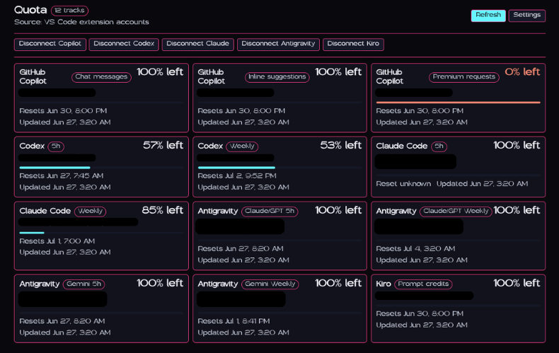
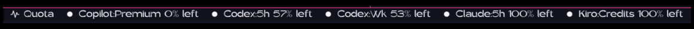

import { Steps, Tabs, TabItem } from '@astrojs/starlight/components';
import { vscode } from '../../../data/site';

The extension puts a **Quota** button in your status bar and opens a panel with every quota you've connected. You can also pin specific quotas next to the button so they're always visible while you code.

It works in VS Code and in editors that use Open VSX, like Antigravity and Kiro. It keeps its own accounts, separate from the desktop app.



## Install

<Tabs>
  <TabItem label="Marketplace">
    Search for **Quota: AI Usage Tracker** in the Extensions view, or open it on the <a href={vscode.marketplace}>Visual Studio Marketplace</a>.
  </TabItem>
  <TabItem label="Open VSX">
    In Antigravity, Kiro or another Open VSX editor, search for **Quota: AI Usage Tracker** in the Extensions view, or open it on <a href={vscode.openVsx}>Open VSX</a>.
  </TabItem>
  <TabItem label="VSIX file">
    <Steps>
      1. Download <a href={vscode.vsix}><code>quota-ai-usage-tracker-{vscode.version}.vsix</code></a>.
      2. Press <kbd>F1</kbd> and run **Extensions: Install from VSIX...**
      3. Pick the file you downloaded.
    </Steps>
  </TabItem>
</Tabs>

## Connect a provider

Open the Command Palette and run the connect command for the provider you want:

- `Quota: Connect GitHub Copilot`
- `Quota: Connect Codex`
- `Quota: Connect Claude Code`
- `Quota: Connect Antigravity`
- `Quota: Connect Kiro`
- `Quota: Connect Grok`
- `Quota: Connect OpenCode Go`

Each one follows that provider's own sign-in flow. For Grok you can skip the browser and run `Quota: Import Local Grok CLI Account`, which reads `~/.grok/auth.json`. OpenCode Go asks for your Go API key from the [OpenCode console](https://opencode.ai/auth) instead.

If a Codex, Claude Code or Grok login expires, the panel keeps the account and shows a **Reauthenticate** action.

## The panel

Click the **Quota** button or run `Quota: Open Quota Panel`. Each card shows the provider and quota name, the account, the percentage, when it resets and when it last updated. The layout goes from one column to several as you make the panel wider.

## Status bar tracks



Add track IDs to `quota.statusBar.items` to pin them next to the button. Each one gets a small colored dot:

- 🟢 more than 30% left
- 🟡 11 to 30% left
- 🔴 10% or less left
- ⚪ no percentage data

| Provider | Track IDs |
| --- | --- |
| GitHub Copilot | `githubCopilot.premium`, `githubCopilot.chat`, `githubCopilot.inline` |
| Codex | `codex.primary` (5 hour), `codex.weekly` |
| Claude Code | `claude.fiveHour`, `claude.weekly`, `claude.weeklySonnet`, `claude.extraUsage` |
| Antigravity | `antigravity.gemini`, `antigravity.geminiWeekly`, `antigravity.claude`, `antigravity.claudeWeekly` |
| Kiro | `kiro.promptCredits` |
| Grok | `grok.credits`, `grok.monthlySpend`, `grok.onDemand` |
| OpenCode Go | `opencodeGo.fiveHour`, `opencodeGo.weekly`, `opencodeGo.monthly` |

## Settings

Run `Quota: Open Settings`, or add these to your `settings.json`. These are the defaults, apart from the example track:

```json
{
  "quota.refresh.intervalSeconds": 120,
  "quota.providers.enabled": [
    "githubCopilot",
    "codex",
    "claude",
    "antigravity",
    "kiro",
    "grok",
    "opencodeGo"
  ],
  "quota.statusBar.enabled": true,
  "quota.statusBar.items": ["codex.primary"],
  "quota.statusBar.display": "percentRemaining",
  "quota.statusBar.maxItems": 3
}
```

Set `quota.statusBar.display` to `percentUsed` if you'd rather see what you've used. The panel bars follow the same setting.

## Commands

Every provider has a matching **Connect**, **Refresh** and **Disconnect** command, like `Quota: Refresh Codex` or `Quota: Disconnect Kiro`. The general ones are:

| Command | What it does |
| --- | --- |
| `Quota: Open Quota Panel` | Opens the panel |
| `Quota: Refresh Summary` | Refreshes every connected provider |
| `Quota: Open Settings` | Opens Quota's settings |
| `Quota: Import Local Grok CLI Account` | Imports Grok accounts from `~/.grok/auth.json` |

Disconnecting deletes the extension's stored credentials and cached usage for that provider.
